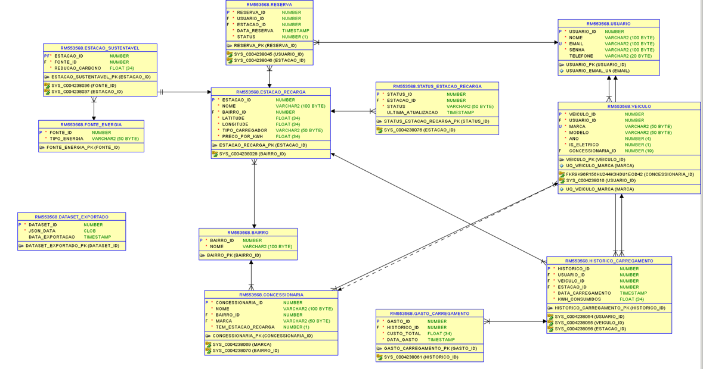
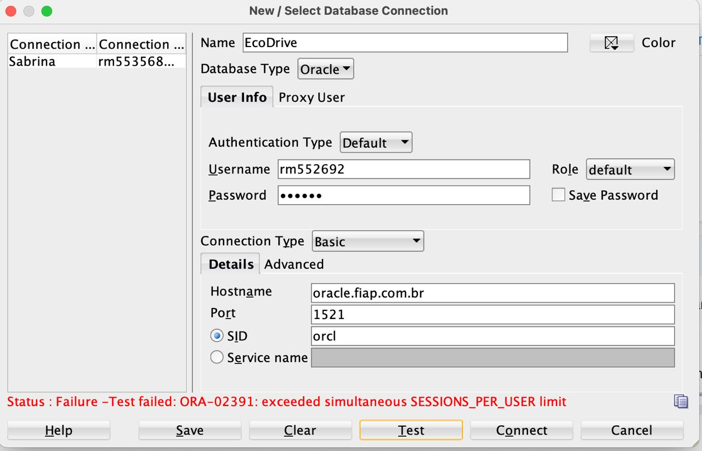
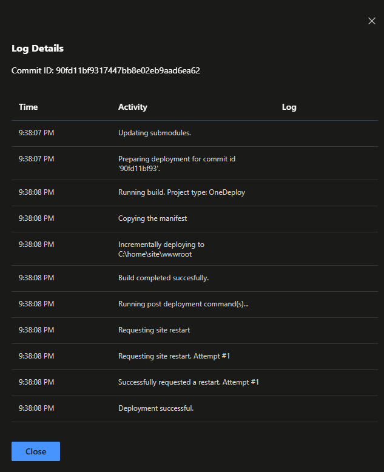
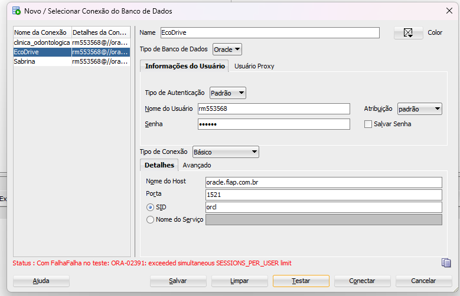
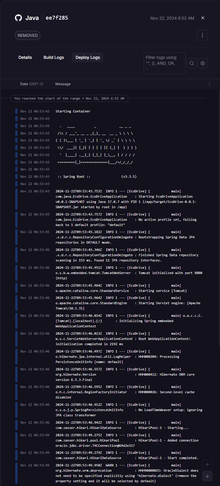
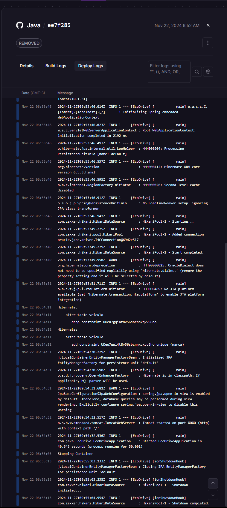

# EcoDrive

### Descrição do Projeto
EcoDrive é uma aplicação móvel desenvolvida para otimizar a experiência de uso de veículos elétricos, facilitando o acesso às estações de carregamento, promovendo o uso de energias renováveis e proporcionando uma experiência de carregamento eficiente e sustentável. A aplicação foi desenvolvida em Java, utilizando Spring Boot, com integrações para APIs RESTful e um sistema completo de CRUD, abrangendo diversas funcionalidades para melhorar a infraestrutura de mobilidade elétrica.

### Vídeo do Software Funcionando 
https://youtu.be/vUCIWn_lwt0

### Vídeo Pitch
https://www.youtube.com/watch?v=8bzh6oU2oPI

### Diagramas

!


### Estrutura do Projeto
O projeto está organizado da seguinte forma:

- **.gitattributes e .gitignore**: Arquivos utilizados para configuração do Git, definindo padrões para gerenciar o controle de versão.

- **mvnw e mvnw.cmd**: Scripts para executar o Maven Wrapper, facilitando o gerenciamento de dependências do projeto.

- **pom.xml**: Arquivo de configuração do Maven, onde estão definidas todas as dependências do projeto.

- **src/main/java**: Diretório principal do código-fonte.
    - **config**: Contém classes de configuração como `ModelMapperConfig.java` e `SwaggerConfig.java` para mapeamento de objetos e documentação da API respectivamente.
    - **controller**: Contém as classes de controle que gerenciam as requisições dos usuários, como `BairroController`, `ConcessionariaController`, `UsuarioController`, entre outros.
    - **dto**: Contém objetos de transferência de dados (DTOs) para facilitar a comunicação entre a camada de controle e a camada de serviço.
    - **model**: Contém as classes de modelo que representam as entidades do banco de dados, como `Bairro`, `Concessionaria`, `Veiculo`, etc.
    - **repository**: Contém interfaces que extendem `JpaRepository`, permitindo o acesso ao banco de dados para realizar operações de CRUD.
    - **service**: Contém as classes de serviço, onde é implementada a lógica de negócios para cada funcionalidade, como `BairroService`, `UsuarioService`, etc.

- **src/main/resources**: Diretório que contém arquivos de configuração do projeto, incluindo `application.properties`, onde são definidos parâmetros de configuração como porta do servidor, banco de dados, etc.

- **src/test/java**: Contém classes para realizar testes unitários e de integração da aplicação.

### Tecnologias Utilizadas
- **Java 11**
- **Spring Boot**
- **Maven**
- **JPA/Hibernate**
- **Swagger** para documentação da API
- **ModelMapper** para facilitação de mapeamento de objetos
- **JDK17** 

### Funcionalidades Principais
- **Gestão de Estações de Recarga**: Permite gerenciar informações relacionadas às estações de recarga para veículos elétricos.
- **Gestão de Reservas**: Usuários podem reservar estações de recarga através do sistema.
- **Gestão de Veículos**: Registro de veículos e o acompanhamento do consumo de energia.
- **Documentação com Swagger**: Documentação detalhada da API RESTful para facilitar a integração.
- **Controle de Usuários**: CRUD completo para gerenciar usuários do sistema.

### Como Executar o Projeto
1. **Clonar o Repositório**
   ```bash
   git clone <URL_DO_REPOSITORIO>
   ```
2. **Entrar no Diretório do Projeto**
   ```bash
   cd Java-main
   ```
3. **Executar o Maven Wrapper para Baixar as Dependências**
   ```bash
   ./mvnw clean install
   ```
4. **Rodar a Aplicação**
   ```bash
   ./mvnw spring-boot:run
   ```
5. **Acessar a Documentação da API**
   Abra o navegador e acesse `http://localhost:8080/swagger-ui.html` para visualizar a documentação gerada pelo Swagger.

#### Endpoints se encontram no swagger

### Configurações Adicionais
- **Banco de Dados**: Configure o arquivo `application.properties` com as credenciais e URL do banco de dados para que a aplicação possa se conectar corretamente.

- **Swagger**: Para acessar a documentação da API, certifique-se de que o Swagger está ativado no arquivo de configuração.

### Problemas Técnicos

O banco inicialmente foi feito no rm do Luis, e no dia da entrega tivemos que mudar, pois deu o erro:

Status : Com FalhaFalha no teste: ORA-02391: exceeded simultaneous SESSIONS_PER_USER limit

Mas no vídeo consegui mostrar que dias atrás a aplicação estava rodando com sucesso





Ontem temtei em outra plataforma e foi normalmente 





